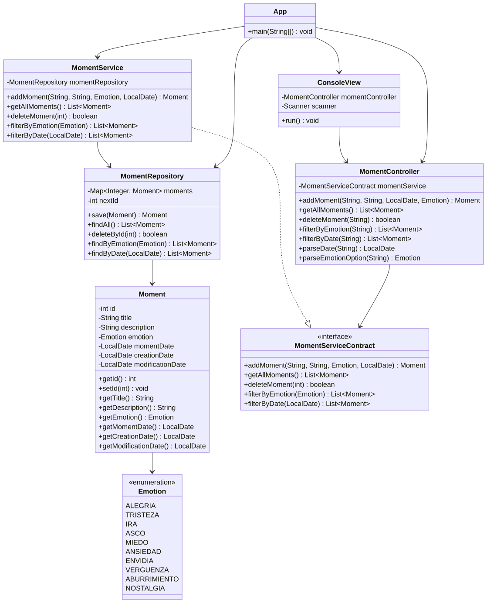
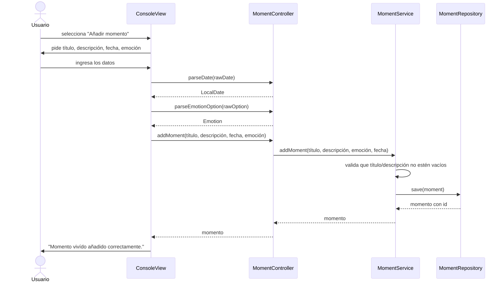
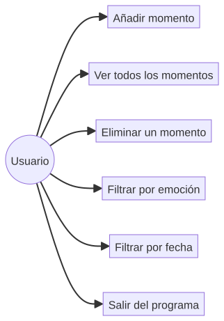

# Mi Diario (Inside Out Diary)

🔗 [Repositorio en GitHub](https://github.com/lcortes89/Inside-out/)

Aplicación de consola para gestionar momentos vividos: cada momento tiene un título, una descripción, una emoción asociada y una fecha. Construida con arquitectura en capas (models, repositories, contracts, services, controllers, view), un repositorio en memoria basado en `Map`, y tests unitarios con JUnit 5, Hamcrest y Mockito.

[](https://www.oracle.com/java/technologies/downloads/) [](https://maven.apache.org/) [](https://junit.org/junit5/) [](https://hamcrest.org/JavaHamcrest/) [](https://site.mockito.org/) [](https://www.jacoco.org/jacoco/) [](https://checkstyle.sourceforge.io/)

<a id="index"></a>

# 📑 Índice

- [📖 Descripción](#description)
- [🚀 Demo](#demo)
- [✨ Funcionalidades](#features)
- [📋 Historias de usuario](#user-stories)
- [🗺 Diagramas UML](#diagrams)
- [🛠 Tecnologías](#technologies)
- [📦 Pre-requisitos](#prerequisites)
- [⚙ Instalación](#installation)
- [▶ Uso](#usage)
- [🧪 Tests y cobertura](#testing)
- [📂 Estructura del proyecto](#structure)
- [👩‍💻 Autora](#author)

<a id="description"></a>

## Descripción

Mi Diario permite al usuario registrar momentos que ha vivido, cada uno con un título, una descripción, una emoción (elegida de una lista fija de 10) y la fecha en que ocurrió. Los momentos se pueden listar, eliminar, y filtrar ya sea por emoción o por una fecha exacta. Los datos se mantienen en memoria mientras dura el programa, usando un `Map<Integer, Moment>` como estructura de almacenamiento.

[↑ Índice](#index) • [Demo →](#demo)

<a id="demo"></a>

## Demo

```
My diario:
1. Añadir momento
2. Ver todos los momentos disponibles
3. Eliminar un momento
4. Filtrar los momentos
5. Salir
Seleccione una opción: 1

Ingrese el título: Un día en el parque de atracciones
Ingrese la descripción: Un día increíble con amigos.
Ingresa la fecha (dd/mm/year): 01/05/2024
Selecciona una emoción:
1. Alegría
2. Tristeza
...
Ingrese su opción: 1
Momento vivído añadido correctamente.

Seleccione una opción: 2

Lista de momentos vividos:
1. Ocurrio el: 01/05/2024. Título: Un día en el parque de atracciones. Descripción: Un día increíble con amigos. Emoción: Alegría

Seleccione una opción: 5

Hasta la próxima!!!
```

[← Descripción](#description) • [↑ Índice](#index) • [Funcionalidades →](#features)

<a id="features"></a>

## Funcionalidades

- Añadir un momento con título, descripción, emoción y fecha, con validación en cada campo (título/descripción vacíos, formato de fecha inválido, emoción fuera de rango o no numérica).
- Ver la lista completa de momentos registrados.
- Eliminar un momento por su identificador.
- Filtrar momentos por emoción o por una fecha exacta.
- Persistencia en memoria usando `Map<Integer, Moment>`.
- Arquitectura en capas: `models` → `repositories` → `services` (+ `contracts`) → `controllers` → `view`, siguiendo el principio de Inversión de Dependencias (DIP) mediante `MomentServiceContract`.
- 39 tests unitarios con JUnit 5, Hamcrest y Mockito, cubriendo el modelo, el repositorio, el servicio, el controlador y la vista de consola — cobertura por encima del 70% requerido.
- Estilo de código verificado con Checkstyle (`com.github.ngeor:checkstyle-rules`).

[← Demo](#demo) • [↑ Índice](#index) • [Historias de usuario →](#user-stories)

<a id="user-stories"></a>

## Historias de usuario

Criterios de aceptación completos en formato Gherkin (Dado/Cuando/Entonces) para cada escenario: [user-stories.md](./user-stories.md)

**HU-01 — Añadir un momento vivido**

**Como** usuario **quiero** añadir un momento vivido con su título, descripción, emoción y fecha **para** poder recordarlo cuando lo necesite.

**Criterios de aceptación:**

> > <details>
> > <summary>Escenario 1: Añadir un momento con datos válidos</summary>
> >
> > - **Dado** que estoy en el menú principal
> > - **Cuando** selecciono "Añadir momento" e introduzco un título, una fecha válida (dd/mm/aaaa), una descripción y una emoción del 1 al 10
> > - **Entonces** el momento se guarda con un identificador único y sus fechas de creación y modificación, y se muestra "Momento vivído añadido correctamente."
> >
> > </details>
> >
> > <details>
> > <summary>Escenario 2: Fecha con formato inválido</summary>
> >
> > - **Dado** que estoy añadiendo un momento
> > - **Cuando** introduzco la fecha en un formato distinto de dd/mm/aaaa
> > - **Entonces** se muestra un mensaje de error indicando el formato correcto y se me vuelve a pedir la fecha
> >
> > </details>
> >
> > <details>
> > <summary>Escenario 3: Emoción fuera de rango</summary>
> >
> > - **Dado** que estoy añadiendo un momento
> > - **Cuando** selecciono una opción de emoción que no está entre 1 y 10
> > - **Entonces** se muestra un mensaje de error y se me vuelve a pedir la emoción
> >
> > </details>
> >
> > <details>
> > <summary>Escenario 4: Campos obligatorios vacíos</summary>
> >
> > - **Dado** que estoy añadiendo un momento
> > - **Cuando** dejo el título o la descripción vacíos
> > - **Entonces** se muestra un mensaje de error indicando que ese campo es obligatorio y no puedo continuar hasta ingresar un valor
> >
> > </details>

---

**HU-02 — Ver todos los momentos**

**Como** usuario **quiero** recuperar la lista de los momentos registrados **para** poder repasarlos.

**Criterios de aceptación:**

> > <details>
> > <summary>Escenario 1: Listar momentos existentes</summary>
> >
> > - **Dado** que hay al menos un momento registrado
> > - **Cuando** selecciono "Ver todos los momentos disponibles"
> > - **Entonces** se muestra la lista con identificador, fecha, título, descripción y emoción de cada momento
> >
> > </details>
> >
> > <details>
> > <summary>Escenario 2: Listar cuando no hay momentos</summary>
> >
> > - **Dado** que no hay ningún momento registrado
> > - **Cuando** selecciono "Ver todos los momentos disponibles"
> > - **Entonces** se muestra un mensaje indicando que todavía no hay momentos registrados
> >
> > </details>

---

**HU-03 — Eliminar un momento**

**Como** usuario **quiero** suprimir un momento vivido **para** evitar duplicados y mantener la lista organizada.

**Criterios de aceptación:**

> > <details>
> > <summary>Escenario 1: Eliminar un momento existente</summary>
> >
> > - **Dado** que existe un momento con identificador 1
> > - **Cuando** selecciono "Eliminar un momento" e introduzco el identificador 1
> > - **Entonces** el momento se elimina y se muestra "Momento vivído eliminado correctamente."
> >
> > </details>
> >
> > <details>
> > <summary>Escenario 2: Eliminar un identificador inexistente</summary>
> >
> > - **Dado** que no existe ningún momento con identificador 99
> > - **Cuando** introduzco el identificador 99 para eliminar
> > - **Entonces** no se elimina nada y se muestra un mensaje indicando que no existe un momento con ese identificador
> >
> > </details>
> >
> > <details>
> > <summary>Escenario 3: Identificador no numérico</summary>
> >
> > - **Dado** que estoy eliminando un momento
> > - **Cuando** introduzco un identificador que no es un número
> > - **Entonces** se muestra un mensaje de error y no se elimina nada
> >
> > </details>

---

**HU-04 — Filtrar por emoción**

**Como** usuario **quiero** obtener los momentos vividos según su emoción **para** poder visualizarlos agrupados por lo que sentí.

**Criterios de aceptación:**

> > <details>
> > <summary>Escenario 1: Filtrar por una emoción con resultados</summary>
> >
> > - **Dado** que existen momentos con la emoción "Alegría"
> > - **Cuando** selecciono "Filtrar los momentos", elijo filtrar por emoción y selecciono "Alegría"
> > - **Entonces** se muestran únicamente los momentos con emoción Alegría
> >
> > </details>
> >
> > <details>
> > <summary>Escenario 2: Filtrar por una emoción sin resultados</summary>
> >
> > - **Dado** que no existe ningún momento con la emoción "Envidia"
> > - **Cuando** filtro por la emoción "Envidia"
> > - **Entonces** se muestra un mensaje indicando que no hay momentos con esa emoción
> >
> > </details>
> >
> > <details>
> > <summary>Escenario 3: Emoción fuera de rango</summary>
> >
> > - **Dado** que estoy filtrando por emoción
> > - **Cuando** selecciono una opción que no está entre 1 y 10
> > - **Entonces** se muestra un mensaje de error
> >
> > </details>
> >
> > <details>
> > <summary>Escenario 4: Texto que no corresponde a ninguna emoción</summary>
> >
> > - **Dado** que estoy filtrando por emoción
> > - **Cuando** introduzco un texto que no corresponde a ninguna emoción
> > - **Entonces** se muestra un mensaje de error
> >
> > </details>

---

**HU-05 — Filtrar por fecha**

**Como** usuario **quiero** obtener los momentos vividos en una fecha concreta **para** poder repasar lo que viví ese día.

**Criterios de aceptación:**

> > <details>
> > <summary>Escenario 1: Filtrar por una fecha con resultados</summary>
> >
> > - **Dado** que existe un momento con fecha 15/05/2024
> > - **Cuando** selecciono "Filtrar los momentos", elijo filtrar por fecha e indico "15/05/2024"
> > - **Entonces** se muestran únicamente los momentos ocurridos ese día
> >
> > </details>
> >
> > <details>
> > <summary>Escenario 2: Filtrar por una fecha sin resultados</summary>
> >
> > - **Dado** que no existe ningún momento en la fecha indicada
> > - **Cuando** filtro por la fecha "01/01/2020"
> > - **Entonces** se muestra un mensaje indicando que no hay momentos en esa fecha
> >
> > </details>
> >
> > <details>
> > <summary>Escenario 3: Formato de fecha inválido</summary>
> >
> > - **Dado** que estoy filtrando por fecha
> > - **Cuando** introduzco la fecha en un formato distinto de dd/mm/aaaa
> > - **Entonces** se muestra un mensaje de error indicando el formato correcto
> >
> > </details>

---

**HU-06 — Salir del programa**

**Como** usuario **quiero** salir del programa **para** poder cerrarlo o iniciar otro.

**Criterios de aceptación:**

> > <details>
> > <summary>Escenario 1: Salir del programa</summary>
> >
> > - **Dado** que estoy en el menú principal
> > - **Cuando** selecciono "Salir"
> > - **Entonces** se muestra "Hasta la próxima!!!" y el programa termina de forma ordenada
> >
> > </details>

[← Funcionalidades](#features) • [↑ Índice](#index) • [Diagramas UML →](#diagrams)

<a id="diagrams"></a>

## Diagramas UML

Miniaturas — haz clic en cualquiera para ver la imagen completa (SVG, se puede hacer zoom):

| Diagrama de clases | Diagrama de secuencia — Añadir un momento | Diagrama de casos de uso |
|:---:|:---:|:---:|
| [](src/diagrams/class-diagram.svg) | [](src/diagrams/sequence-diagram-es.svg) | [](src/diagrams/usecase-diagram.svg) |

[← Historias de usuario](#user-stories) • [↑ Índice](#index) • [Tecnologías →](#technologies)

<a id="technologies"></a>

## Tecnologías

-  — Lenguaje de programación usado en el proyecto
-  — Gestión de dependencias y build
-  — Framework de tests unitarios
-  — Librería de matchers para aserciones legibles
-  — Framework de mocks para aislar capas en los tests
-  — Medición de cobertura de tests
-  — Verificación estática de estilo de código
-  — Editor usado para desarrollar el proyecto
-  — Lenguaje de marcado del README
-   — Control de versiones y alojamiento del proyecto

[← Diagramas UML](#diagrams) • [↑ Índice](#index) • [Pre-requisitos →](#prerequisites)

<a id="prerequisites"></a>

## Pre-requisitos

Antes de clonar y ejecutar el proyecto, necesitas tener instalado:

- [Java 21 (JDK)](https://www.oracle.com/java/technologies/downloads/#java21)
- [Maven 3.6.3 o superior](https://maven.apache.org/download.cgi)
- [Git](https://git-scm.com/downloads)

[← Tecnologías](#technologies) • [↑ Índice](#index) • [Instalación →](#installation)

<a id="installation"></a>

## Instalación

```bash
git clone https://github.com/lcortes89/inside-out-diary.git
cd inside-out-diary
```

[← Tecnologías](#technologies) • [↑ Índice](#index) • [Uso →](#usage)

<a id="usage"></a>

## Uso

```bash
mvn clean compile
java -cp target/classes org.luisa.diary.App
```

Sigue el menú en pantalla para añadir, ver, eliminar o filtrar tus momentos. Los datos se guardan solo en memoria, así que se reinician cada vez que cierras el programa.

[← Instalación](#installation) • [↑ Índice](#index) • [Tests y cobertura →](#testing)

<a id="testing"></a>

## Tests y cobertura

```bash
mvn test
```

39 tests unitarios con JUnit 5, Hamcrest y Mockito, cubriendo `Moment`, `MomentRepository`, `MomentService`, `MomentController` y `ConsoleView`. La cobertura se verifica con JaCoCo con un mínimo del 70% (instrucciones y ramas), comprobado automáticamente en cada `mvn test`.

Checkstyle no está enlazado a la fase `test` en este proyecto, así que hay que correrlo aparte:

```bash
mvn checkstyle:check
```

[← Uso](#usage) • [↑ Índice](#index) • [Estructura del proyecto →](#structure)

<a id="structure"></a>

## Estructura del proyecto

```
INSIDE-OUT/
├── pom.xml
├── README.md
├── src/
│   ├── main/java/org/luisa/diary/
│   │   ├── App.java
│   │   ├── contracts/
│   │   │   └── MomentServiceContract.java
│   │   ├── controllers/
│   │   │   └── MomentController.java
│   │   ├── models/
│   │   │   ├── Emotion.java
│   │   │   └── Moment.java
│   │   ├── repositories/
│   │   │   └── MomentRepository.java
│   │   ├── services/
│   │   │   └── MomentService.java
│   │   └── view/
│   │       └── ConsoleView.java
│   └── test/java/org/luisa/diary/
│       ├── AppTest.java
│       ├── controllers/MomentControllerTest.java
│       ├── models/MomentTest.java
│       ├── repositories/MomentRepositoryTest.java
│       ├── services/MomentServiceTest.java
│       └── view/ConsoleViewTest.java
```

[← Tests y cobertura](#testing) • [↑ Índice](#index) • [Autora →](#author)

<a id="author"></a>

## Autora

**[Luisa Cortés](https://github.com/lcortes89)**

[← Estructura del proyecto](#structure) • [↑ Índice](#index)
